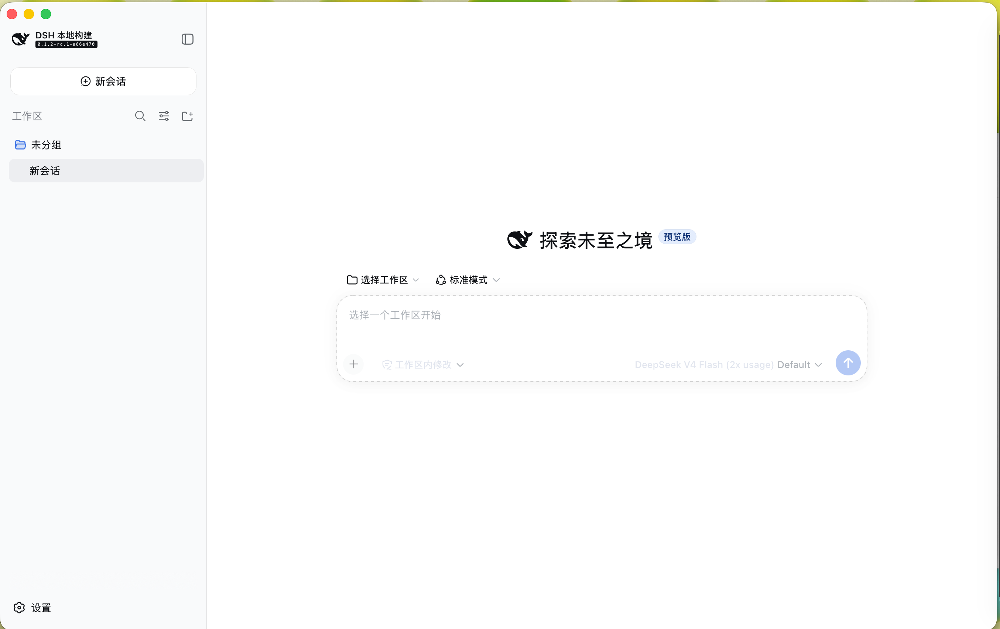
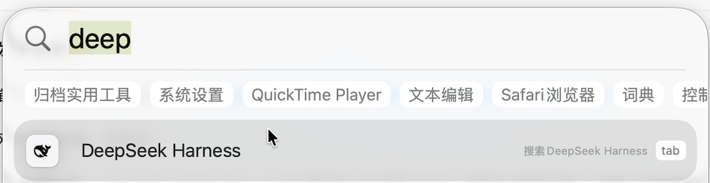

# DSH Shell

为 DeepSeek Harness 提供一个 macOS 原生 App 薄壳：通过 AppKit + WKWebView 显示
[DeepSeek Harness](https://github.com/deepseek-ai/deepseek-harness) 的 Web UI。
构建产物在 macOS 中显示为 **DeepSeek Harness.app**。享受原生 App 的体验：

- 从“应用程序”或聚焦（Spotlight）启动
- 符合直觉的 macOS 快捷键

> 本项目不是 DeepSeek 官方产品。


<p align="center">
  
</p>

<p align="center">
  
</p>

## 特点

- **轻量原生**：纯 AppKit + WKWebView 实现，安装包不到 1 MB，没有 Electron 之类的运行时包袱。
- **是一个真正的 Mac 应用**：放入“应用程序”后即可用 Spotlight、Dock 和 ⌘Tab 启动切换，配备标准菜单栏和快捷键——⌘N 新对话、⇧⌘R 重启 Server、⌥⌘L 打开 Console。
- **窗口即点即开**：启动画面带真实进度（获取、安装依赖、构建各阶段都有百分比）；日常启动直接复用已构建的 DSH，不重复安装。
- **与 macOS 融为一体的外观**：透明标题栏加全高度内容视图，DSH 界面一直延伸到红绿灯按钮之下，看起来就是一块完整的原生窗口。适配通过运行时注入的少量 CSS 与脚本完成，不修改 DSH 的任何源码。
- **托管 DSH 完整生命周期**：自动克隆、跟踪最新 RC、构建并启动本地服务；退出时连同全部子进程干净停止，遗留的 Server 会在下次启动时安全清理。
- **直连官方 Git 仓库**：DSH 不打包进 App，而是在本机维护一份从官方仓库拉取的 Git 克隆，按版本 tag 跟踪——上游发布新 RC 后 App 直接跟进，无需重打包DSH Shell。若想用自己魔改的 DSH ，把这份克隆换成你的仓库即可（见[替换 DSH 仓库](#替换为自己的-dsh-仓库)）。

## 下载与首次打开

GitHub Releases 提供自动构建的 Universal macOS ZIP，同时支持 Apple Silicon 和 Intel Mac。
该产物使用 ad-hoc 签名，但**没有 Developer ID 签名，也没有经过 Apple 公证**。

1. 下载并解压 `DeepSeek-Harness-*-macOS-universal-unsigned.zip`，将 App 移入“应用程序”。
2. 第一次尝试打开时，macOS 可能阻止运行。
3. 打开“系统设置 → 隐私与安全性”，在安全性区域选择“仍要打开”，然后确认。

只有在你信任本仓库及对应 Release 时才应手动放行。受组织管理的 Mac 可能不允许绕过该限制。


## 运行要求

- macOS 14 或更高版本
- Git：一般已随 Xcode 或“命令行开发者工具”安装。全新 Mac 首次用到 git 时，系统通常会弹窗引导安装（需联网下载）；也可提前执行 `xcode-select --install`
- Node.js `^22.19.0` 或 `>=24.0.0`：需自行安装（nodejs.org、Homebrew 等），App 不会代为安装
- pnpm：需自行安装且位于 PATH 中，推荐启用 Node 自带的 Corepack（`corepack enable`），建议使用 DSH 当前声明的 `11.7.0`
- 首次准备与后续更新需要能访问 GitHub 和 npm registry。App 自动完成的是克隆 DSH 源码、安装其 npm 依赖并构建；网络不佳时首次启动会明显变慢甚至失败，依赖就绪后的日常启动只保留一次轻量的版本检查

DSH、Node 和 pnpm 均不打包进 App。Git、Node 或 pnpm 缺失时启动准备会失败，完整原因可在 DSH Console 中查看。

## 工作方式

首次启动会将 DSH 克隆到：

```text
~/Library/Application Support/DSHShell/deepseek-harness
```

App 选择本地可用的最新 RC tag；没有 RC 时回退到最新版本 tag。首次运行或版本变化时执行
`pnpm install --frozen-lockfile` 和 `pnpm run build`，随后以 `pnpm dsh web --no-open`
启动本地服务。正常启动后只在后台执行 `git fetch --tags --prune`；发现新版本时由用户确认重启更新。

App 只管理自己的 Application Support 仓库，不会修改用户的其他 DSH checkout。完整 Server 输出可从
“DSH → 显示 Console”查看。

### 替换为自己的 DSH 仓库

`~/Library/Application Support/DSHShell/deepseek-harness` 只是一份普通的 Git 克隆，App 不锁定 DSH 的来源。想使用自己的 fork 或魔改版本时：

1. 退出 App。
2. 用你的仓库克隆替换该目录。保留 `.git` 目录，并确保仓库带有 `x.y.z` 格式的版本 tag——App 依据 tag 选择和比较版本。
3. 重新启动 App。

App 会自动检出其中最新的版本 tag，重新安装依赖、构建并启动，之后的更新检查也会改为跟踪这份克隆自己的远端。若魔改后的界面结构变化过大，标题栏避让等注入适配可能失效，但不影响基本使用。

## 从源码构建

需要 Xcode 16 或更高版本。打开 `DSHShell.xcodeproj`，选择 `DSHShell` scheme 后运行即可。

也可以使用命令行：

```bash
xcodebuild -project DSHShell.xcodeproj \
  -scheme DSHShell \
  -configuration Debug \
  -destination 'platform=macOS' \
  build
```

## 安全与版本说明

这个 App 会下载并执行最新 DSH RC 及其锁定的 npm 依赖。相同版本的 Shell 在不同日期首次启动时，
可能获得不同的 DSH RC。公开安装前请理解这一信任边界；Release 的 SHA-256 只能校验 Shell 包体，
不能固定首次启动后下载的 DSH 内容。

## 许可证与品牌

本项目代码以 [MIT License](LICENSE) 发布。DSH 及随附鱼形素材的许可和归属见
[THIRD_PARTY_NOTICES.md](THIRD_PARTY_NOTICES.md)。`DeepSeek Harness` 是上游项目/品牌名称；本项目
仅作为非官方本地 macOS 承载程序使用该显示名称。
